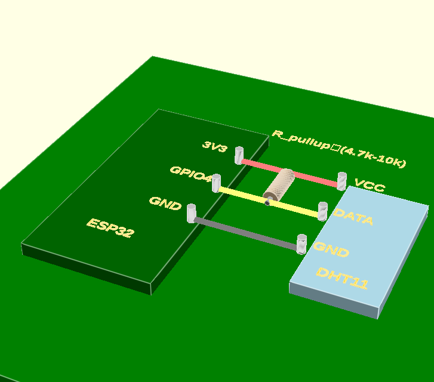

ESP-DHT11-MQTT HumidityFrog
===========================

## Circuit Diagram

The DHT11 sensor is connected as follows:

*   DHT11 VCC -> ESP32 3.3V
*   DHT11 GND -> ESP32 GND
*   DHT11 DATA -> ESP32 GPIO4 (defined by `DHT_PIN`)
*   A 4.7kΩ to 10kΩ pull-up resistor connects DHT11 DATA to DHT11 VCC.

HumidityFrog is an ESP-IDF ESP32-DHT11 sensor reporter over MQTT. I used an ESP32-WROOM 32S, you can configure for other similar devices.

I wanted something simple and cheap for my 3D printing lab and also track the effect of humidity on my allergies.

It uses a low-budget DHT11 sensor, not the most accurate thing in the world but able to get a sense of Dry/Normal/Damp and within a few degrees of temperature. It should mount inside the AMS filament spooler for my printer, or even have a few around the site. It's set up to publish on MQTT esp32/dht11 topic, but of course whatever it's up to you, modify as you do. I tested vs mosquitto broker, be sure your ufw/firewalls are permissive of TCP 1883. No TLS. 

 * Reads temperature and humidity data from the DHT11 sensor.
 *
 * Connections:
 *   ESP32 Pin   |   DHT11 Pin
 * ------------- | -------------
 *    GPIO_NUM_4 |   DATA (Pin 2)  <- Set by DHT_PIN define
 *    3.3V       |   VCC (Pin 1)
 *    GND        |   GND (Pin 4)
 *
 *   Note: A 4.7k Ohm to 10k Ohm pull-up resistor between DATA and VCC is recommended.
 *         The internal ESP32 pull-up might be sufficient sometimes, but external is more reliable.
 *         Pin 3 on DHT11 is Not Connected.
 *
 * ASCII Diagram (Typical 3/4 pin module):
 *
 *       ESP32                     DHT11 Module
 *      +-------+                   +-----------+
 *      | 3V3   |-------------------| VCC / +   |
 *      |       |                   |           |
 *      | GND   |-------------------| GND / -   |
 *      |       |       |+--[R]---+ |           |  R = 4.7k-10k Pull-up
 *      | GPIO4 |-------+-----------| DATA / out|
 *      +-------+                   +-----------+
 *

Please check [ESP-IDF docs](https://docs.espressif.com/projects/esp-idf/en/latest/get-started/index.html) for getting started instructions.

*Code in this repository is in the Public Domain (or CC0 licensed, at your option.)
Unless required by applicable law or agreed to in writing, this
software is distributed on an "AS IS" BASIS, WITHOUT WARRANTIES OR
CONDITIONS OF ANY KIND, either express or implied.*
